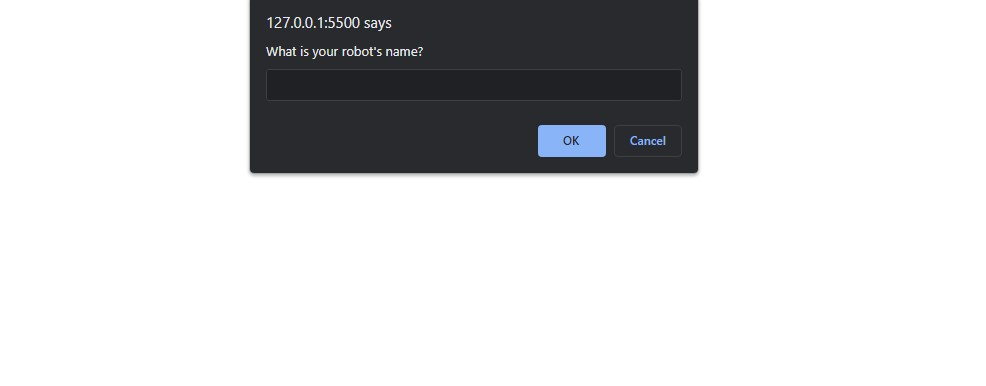

# Robot Gladiators

### Description
This front-end web application is a (MVP) robot fighting type game that is played through web alerts. During the game, players will coach their robot through a series of fights—gaining cash, attack power, and repairs along the way. The robot that survives with the most cash will be remembered in the browser's storage system.

### Application Demo

### Table of Contents
- [Description](#description)
- [Contributing](#contributing)
- [Tests](#tests)
- [Questions?](#questions)

### Contributing
No contributions at this time.

### Tests
N/A

### Questions
GitHub Username: (kcaseychamberlain) 

View the project in GitHub at: https://github.com/KCaseyChamberlain/robot-gladiators

View the application live hosted at: https://kcaseychamberlain.github.io/robot-gladiators/

If you have any questions, contact Casey at: caseygchamberlain@gmail.com